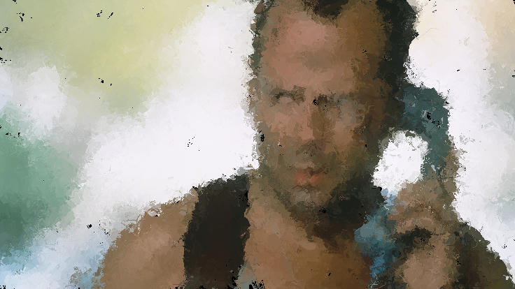

# painterz

in progress. end goal is to perform some sort of image approximation using brush strokes, somewhat like [circlez](https://github.com/anarchisthoneybun/circlez). below images are what it does so far

|  |  |  |
|----------------------------|----------------------------|----------------------------|